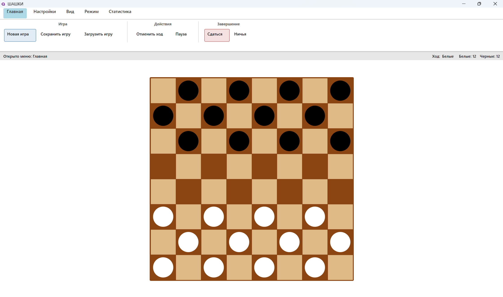

# Шашки - Настольная игра

Классическая настольная игра "Шашки" с современным интерфейсом, реализованная на платформе Avalonia UI с использованием Ribbon-панели.

## Особенности

- **Полнофункциональная игра в шашки** по классическим правилам
- **Современный интерфейс** на базе Avalonia UI
- **Ribbon-панель** для удобного управления игрой
- **Статистика игроков**

## Скриншоты

*Главное меню игры*

## Разработчики

- Якутин Алексей, ПМ-23
- Лужанский Александр, ПМ-23